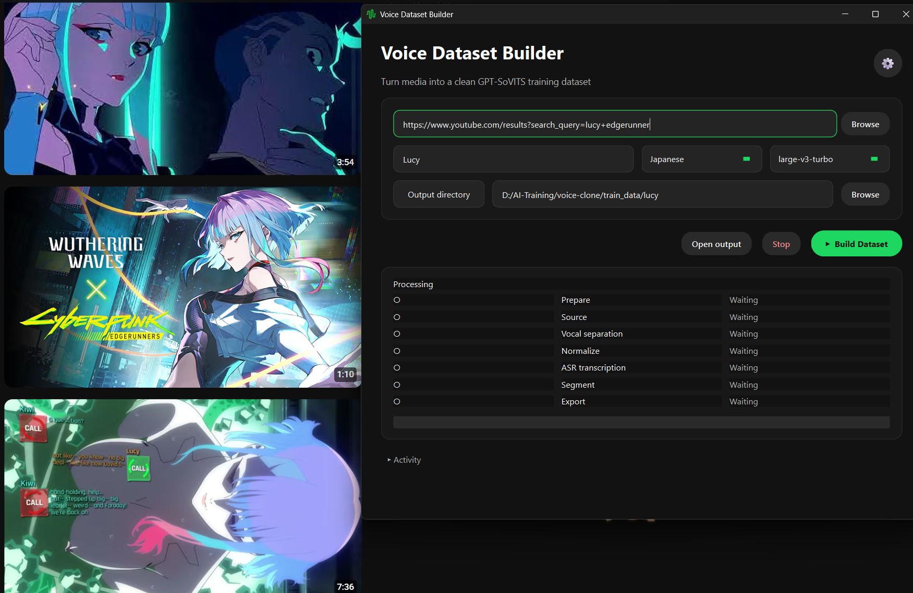

# Voice Dataset Builder

一个面向 GPT-SoVITS 等 TTS 训练流程的本地语音数据集构建工具。

它可以把 **本地音频 / 视频文件、YouTube 链接、Bilibili 链接** 自动处理为干净的人声训练片段，并生成 GPT-SoVITS 可直接使用的数据清单。

项目同时提供：

- **桌面 GUI**：适合日常使用，支持输入路径 / URL、模型管理、阶段进度、错误提示与任务续接；
- **CLI**：适合调试、批量处理和自动化脚本。

你只需要 **输入链接** 和 **确认地址**:


> 当前默认假设：单个素材中**主要**只有一个目标说话人，可自动去除 BGM，但暂不具备多说话人分轨识别提取。


---

## 写在前面

本项目旨在大幅消减训练时寻找、整理、构建数据的时间成本和人力成本；鼓励使用者传播或者按需对其进行特化改造，但是！**请勿进行商用、诈骗等用途**。

本项目只是提供了一个快速批量构建voice clone等text-to-speech(tts) 任务训练数据的小工具；无法对任何使用者的任何行为有约束力，因此不对任何负面甚至非法行为和相应后果负任何责任。

---

## 主要功能以及技术概要

- 本地音频 / 视频文件导入
- YouTube / Bilibili 音频获取
- Demucs 人声分离
- FFmpeg 音频标准化
- faster-whisper 多语言 ASR
- 自动生成适合 TTS 的短语音片段
- ASR 置信度与时长过滤
- GPT-SoVITS `dataset.list` 导出
- 中断恢复与阶段缓存
- GUI 模型缓存目录配置
- NVIDIA CUDA 加速；无 NVIDIA GPU 时可使用 CPU 模式

典型处理流程：

```text
Audio / Video / URL
        ↓
Source acquisition
        ↓
Vocal separation
        ↓
Audio normalization
        ↓
ASR transcription
        ↓
Segmentation & filtering
        ↓
clips / transcript / manifest / dataset.list
```

---

## 项目结构

```text
.
├── voice_dataset_builder.py     # GUI 入口
├── build_dataset.py             # CLI 入口
├── requirements.txt
├── requirements-gui.txt
├── requirements-build.txt
├── VoiceDatasetBuilder.spec
├── scripts/
│   └── build_windows.ps1
├── vendor/
│   └── ffmpeg/
├── assets/
├── tts_builder/
│   ├── pipeline.py
│   ├── separator.py
│   ├── transcriber.py
│   ├── segmenter.py
│   ├── dataset.py
│   ├── cache.py
│   ├── sources/
│   └── gui/
└── tests/
```

---

# 快速开始

## 1. 环境要求

推荐环境：

```text
Windows 10 / 11
Python 3.12
NVIDIA GPU + CUDA（推荐，但不是必须）
FFmpeg
```

CPU 模式也可以运行，但 Demucs 和 ASR 会明显更慢。

---

## 2. 安装 Python 环境

推荐使用 `uv`。

安装 uv：

```powershell
winget install --id=astral-sh.uv -e
```

进入项目目录后创建环境：

```powershell
uv venv --python 3.12
```

激活环境：

```powershell
.venv\Scripts\Activate.ps1
```

安装核心依赖：

```powershell
uv pip install -r requirements.txt
```

安装 GUI 依赖：

```powershell
uv pip install -r requirements-gui.txt
```

如果你已经有兼容的 GPT-SoVITS / PyTorch 环境，也可以直接复用现有虚拟环境。

---

## 3. 安装 FFmpeg

Windows 推荐：

```powershell
winget install --id Gyan.FFmpeg -e
```

安装后重新打开终端并确认：

```powershell
ffmpeg -version
ffprobe -version
```

只要这两个命令能正常输出版本信息，开发态就不需要手动复制 `ffmpeg.exe`。

---

# 使用桌面 GUI

启动：

```powershell
python voice_dataset_builder.py
```

首次启动只进行本机环境检查，不会立即联网下载模型。

GUI 中可以设置：

- 输入文件 / URL
- Speaker 名称
- Language
- ASR Model
- 当前任务输出目录
- 默认输出目录
- 模型存储根目录

开始任务后，界面会展示：

```text
Prepare
Source
Vocal Separation
Normalize
ASR
Segment
Export
```

各阶段会显示运行中、已完成、缓存命中或失败状态。

---

## 模型存储

GUI 中的 `Model storage root` 是模型总目录，例如：

```text
D:\AI_Cache\VoiceDatasetBuilder
```

程序内部会使用：

```text
D:\AI_Cache\VoiceDatasetBuilder\huggingface
D:\AI_Cache\VoiceDatasetBuilder\torch
```

其中：

- Hugging Face：faster-whisper 模型
- Torch：Demucs 模型

第一次真正使用模型时才会下载。

下载过程中如果网络中断，已有缓存会保留，重新 Retry 时不会主动删除已下载内容。

---

# 使用 CLI

CLI 入口：

```powershell
python build_dataset.py -h
```

## 本地音频

```powershell
python build_dataset.py input.m4a --speaker target --language ja
```

## YouTube

```powershell
python build_dataset.py "https://www.youtube.com/watch?v=..." --speaker target --language ja
```

## Bilibili

```powershell
python build_dataset.py "https://www.bilibili.com/video/BV..." --speaker target --language ja
```

## 已经是纯人声音频

可跳过 Demucs：

```powershell
python build_dataset.py vocals.wav --speaker target --language ja --skip-separation
```

默认 ASR 模型：

```text
large-v3-turbo
```

调试时可改为：

```powershell
--asr-model small
```

---

# 中断恢复与缓存

工具会自动保留可复用阶段结果。

任务失败或停止后，重新执行同一个 source 时，会尽量从最近可复用阶段继续，而不是从头处理。

运行过程中可能保留：

```text
source audio
separated vocals
normalized audio
ASR result
state information
```

任务成功后会自动执行 compact 清理：

保留：

```text
source audio
ASR JSON
state JSON
final clips
manifest.jsonl
dataset.list
```

删除体积较大的临时中间文件，例如：

```text
separated vocals
normalized full-length WAV
```

如需强制重新处理某个 source：

```powershell
--fresh
```

调试时希望保留全部中间文件：

```powershell
--keep-temp
```

---

# 输出结果

默认会生成：

```text
clips/
transcripts/
manifest.jsonl
dataset.list
```

## `clips/*.wav`

最终用于训练的短语音片段。

默认切片目标：

```text
推荐：4 ~ 8 秒
硬限制：3 ~ 12 秒
```

## `manifest.jsonl`

通用数据格式，例如：

```json
{"audio":"clips/sample_0001.wav","speaker":"target","language":"ja","text":"今日はいい天気ですね。","confidence":0.93}
```

## `dataset.list`

GPT-SoVITS 格式：

```text
ABSOLUTE_WAV_PATH|target|ja|今日はいい天気ですね。
```

---

# GPU 与 CPU

检测到 NVIDIA CUDA 时，程序会优先使用 GPU。

推荐正式构建使用：

```text
large-v3-turbo
```

无 NVIDIA GPU 时可以使用 CPU 模式。

如果 Demucs 显存不足，可使用：

```powershell
--separator-device cpu
```

如果 ASR 需要使用 CPU：

```powershell
--asr-device cpu
```

---

# Windows 打包 （可选，非传递形exe）

项目采用 **PyInstaller onedir** 方式发布 Windows 桌面程序。

最终用户只需要启动：

```text
VoiceDatasetBuilder.exe
```

依赖文件会放在同一发布目录中，而不是强行压缩成单文件 EXE。

## 1. 安装打包依赖

```powershell
uv pip install -r requirements-build.txt
```

## 2. 准备 FFmpeg

将 Windows 版文件放入：

```text
vendor/ffmpeg/ffmpeg.exe
vendor/ffmpeg/ffprobe.exe
```

开发态不需要做这一步；这里只是为了让最终发布包不依赖用户系统安装 FFmpeg。

## 3. 执行构建

```powershell
powershell -ExecutionPolicy Bypass -File scripts/build_windows.ps1
```

生成目录：

```text
dist/VoiceDatasetBuilder/
```

主程序：

```text
dist/VoiceDatasetBuilder/VoiceDatasetBuilder.exe
```

> Windows EXE 必须在 Windows 环境构建。PyInstaller 不支持从 Linux/macOS 直接交叉生成 Windows EXE。

---

# 已知限制

当前版本不处理：

- 多说话人 diarization
- 自动判断谁是目标说话人
- Bilibili 会员 / 登录限制内容的自动认证
- 自动读取浏览器 Cookie
- LLM 文本纠错
- 手工音频编辑 / 波形剪辑

当前具备初级分辨主说话人的能力，但是如果素材中多人频繁交替说话，建议先单独整理目标说话人的素材，再导入本工具。

---

# License / Distribution

发布前请根据项目实际情况补充 License、第三方依赖许可和 FFmpeg 分发说明。
